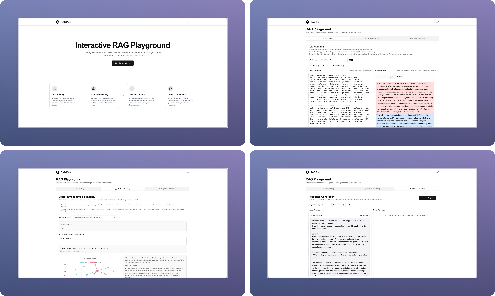

# RAG Playground

An interactive visualization tool for understanding Retrieval-Augmented Generation (RAG) pipelines. This project helps developers and researchers explore and debug each step of the RAG process through hands-on experiments and real-time demonstrations.



## Features

- **Text Splitting Visualization**: Watch how documents are split into meaningful chunks while preserving semantic coherence and context
- **Vector Embedding Analysis**: See how text is transformed into numerical vectors and visualize their relationships in high-dimensional space
- **Semantic Search Demo**: Experience real-time vector similarity search and understand how relevant context is retrieved from your knowledge base
- **Context Generation**: Observe how LLMs combine retrieved context with user queries to generate accurate, contextual responses

## Tech Stack

- **Framework**: Next.js 14 with App Router
- **Language**: TypeScript
- **Styling**: TailwindCSS
- **UI Components**: shadcn/ui
- **Vector Operations**: Transformers.js
- **Text Processing**: LangChain
- **Markdown Rendering**: markdown-it

## Getting Started

1. Clone the repository:

```bash
git clone https://github.com/Kain-90/RAG-Play
cd RAG-Play
```

2. Install dependencies:

```bash
npm install
# or
yarn install
# or
pnpm install
```

3. Set up environment variables:

```bash
cp .env.example .env
```

4. Start the development server:

```bash
npm run dev
# or
yarn dev
# or
pnpm dev
```

5. Open [http://localhost:3000](http://localhost:3000) with your browser to see the result.

## Project Structure

```
src/
├── app/
│   ├── experiment/           # RAG experiment pages and components
│   │   ├── components/       # Experiment-specific components
│   │   ├── types/            # TypeScript types for RAG operations
│   │   └── workers/          # Web Workers for embedding computation
│   ├── components/           # Shared components
│   └── stores/               # Global state management
├── components/               # UI components
└── lib/                      # Utility functions and helpers
```

## Key Components

- **Text Splitting Tab**: Visualizes document chunking with different strategies
- **Embedding Tab**: Demonstrates vector embedding generation and similarity computation
- **Generation Tab**: Shows how context and queries combine for response generation

## Roadmap

- [x] Text chunking tab
  - [x] Add configurable chunk size and overlap settings
  - [x] Support multiple splitting strategies (character, recursive character)
  - [x] Enable real-time preview of splitting results
  - [ ] Add custom delimiter-based splitting
- [x] Embedding tab
  - [x] Basic vector similarity visualization
  - [x] Real-time similarity score display
  - [x] Implement UMAP for high-dimensional vector visualization
  - [x] Support real-time visualization updates during embedding generation
- [x] Implement advanced retrieval and reranking features
  - [x] Basic semantic search functionality
  - [x] Real-time similarity scoring
  - [ ] Support multiple reranking models (e.g., Cohere, BGE)
  - [ ] Implement hybrid search (combining sparse and dense retrievers)
  - [ ] Visualize reranking process and score changes
  - [ ] Enable A/B testing of different reranking strategies
- [x] Generation tab
  - [x] Real-time response generation
  - [x] Context display
  - [x] Add configurable generation model settings (e.g., temperature, max_tokens)

## Contributing

Contributions are welcome! Please feel free to submit a Pull Request.

## License

This project is licensed under the MIT License - see the LICENSE file for details.

## Acknowledgments

- [LangChain](https://js.langchain.com/) for text splitting utilities
- [Transformers.js](https://huggingface.co/docs/transformers.js) for embedding models
- [shadcn/ui](https://ui.shadcn.com/) for the component library
